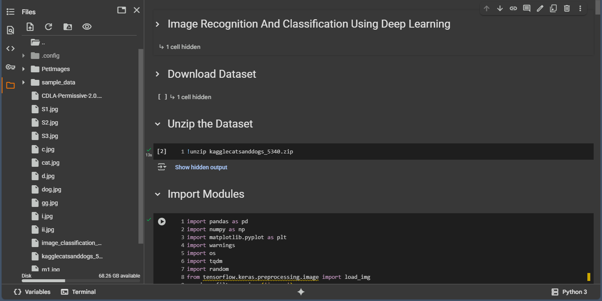
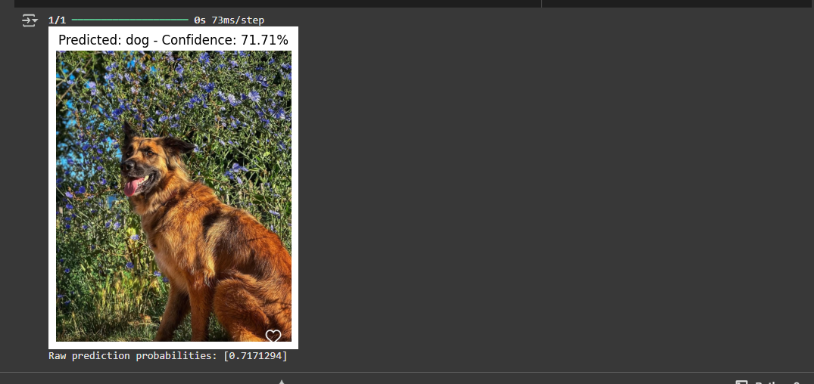

#  Image Recognition and Classification using Deep Learning

This project demonstrates how to use Convolutional Neural Networks (CNNs) to classify images of cats and dogs. It uses TensorFlow and Keras to build, train, and evaluate a deep learning model on the popular *Kaggle Cats vs Dogs dataset*.

## 📂 Dataset

- *Source*: [Kaggle Cats and Dogs](https://www.kaggle.com/c/dogs-vs-cats/data)
- *Format*: .zip file containing labeled images
- *Classes*: cats, dogs

## 🛠 Technologies Used

- Python 🐍
- Google Colab 💻
- TensorFlow/Keras
- NumPy & Pandas
- Matplotlib for visualizations

## 🚀 Features

- Data extraction and preprocessing
- Visualization of dataset samples
- CNN model creation using Keras
- Model training and validation
- Accuracy and loss plotting
- Prediction on new/unseen images

## 📸 Sample Output

Model achieves high accuracy distinguishing cats from dogs in images using CNNs.

## 💡 How to Run

1. Open the notebook in Google Colab
2. Upload the dataset zip file
3. Run the cells in order
4. Use the final model for predictions

## 📌 Future Improvements

- Add more image classes
- Use data augmentation
- Implement transfer learning with pre-trained models like ResNet or VGG

Intro Page.png

## ⭐ Give this repo a star if it helped you!
